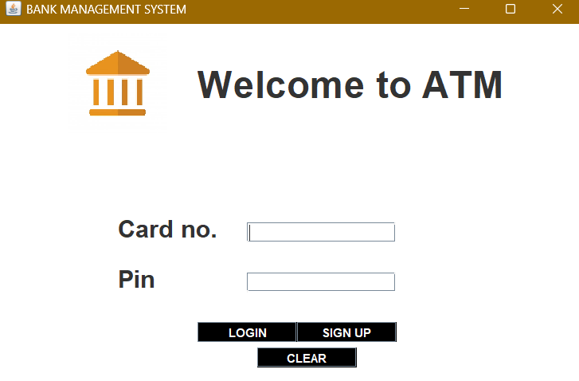
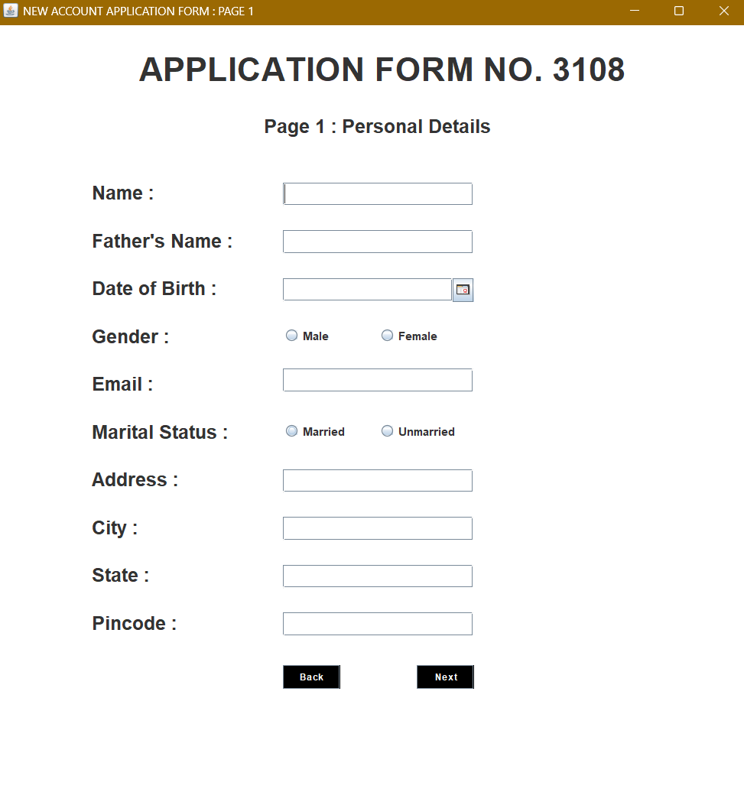
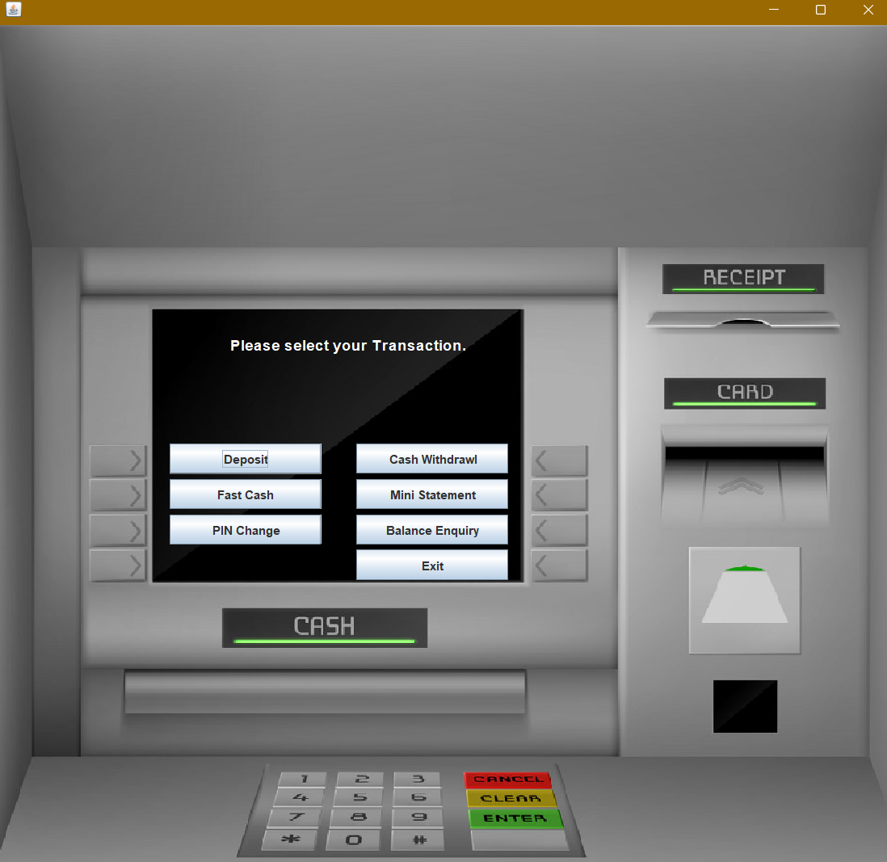
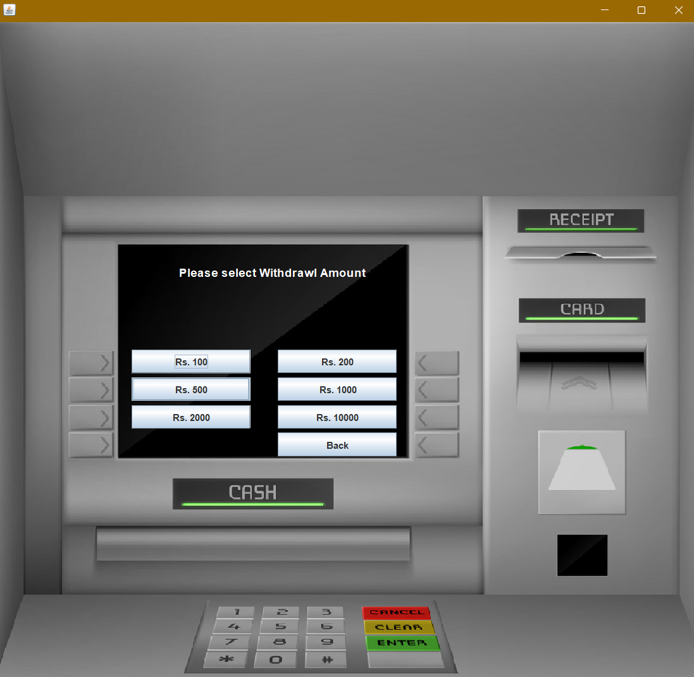
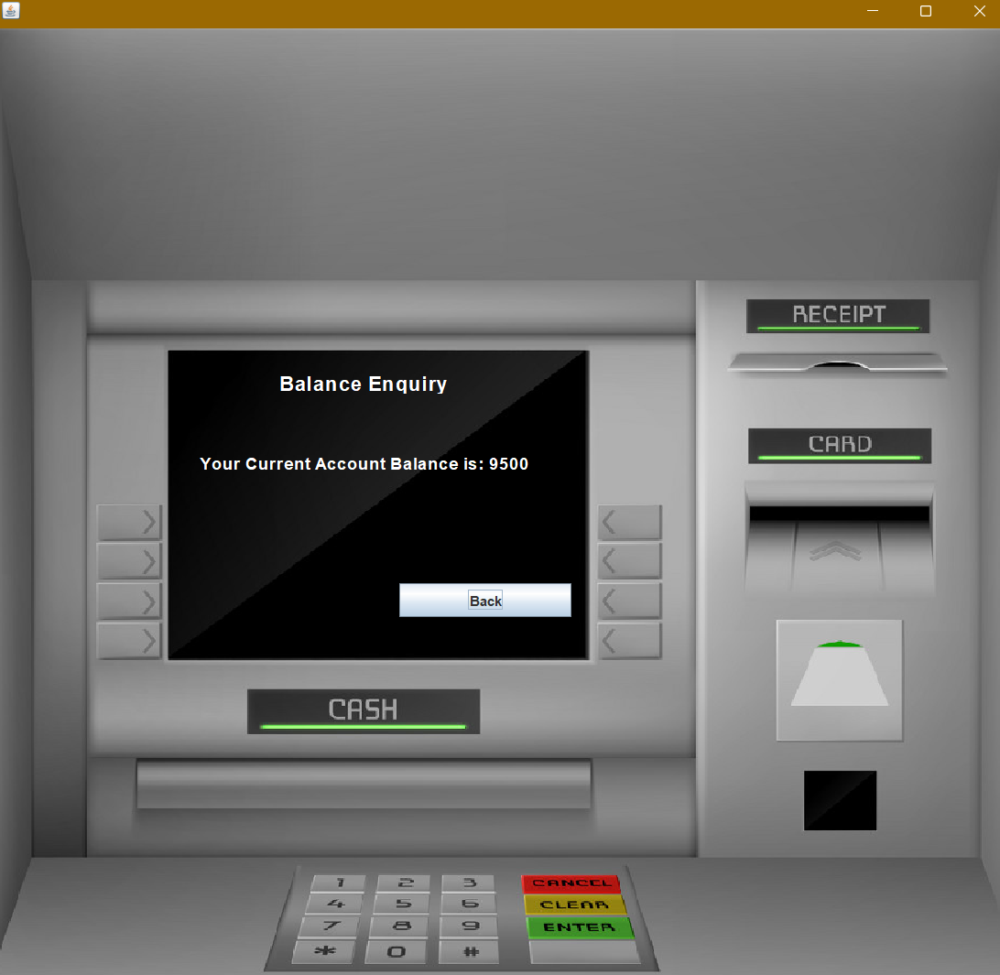

# 🏦 Bank Management System

A desktop-based **Bank Management System** developed using **Java Swing** and **MySQL** that simulates ATM operations such as account creation, login, deposits, withdrawals, balance enquiry, mini statements, PIN changes, and fast cash transactions.

The application provides a user-friendly graphical interface inspired by a real ATM machine and securely stores customer information and transaction records using MySQL.

---

## 📌 Features

### 👤 Account Management
- New Account Registration
- Multi-step Signup Process
- Secure Login using Card Number and PIN
- PIN Change

### 💰 Banking Operations
- Deposit Money
- Cash Withdrawal
- Fast Cash
- Balance Enquiry
- Mini Statement
- Transaction History
- Exit Session

### 🗄 Database
- Customer Details
- Login Credentials
- Account Information
- Transaction Records

---

# 🛠 Tech Stack

| Technology | Used |
|------------|------|
| Java | Java 24 |
| GUI | Java Swing |
| Database | MySQL |
| Connectivity | JDBC |
| IDE | Apache NetBeans |
| Build Tool | Apache Ant |
| Calendar Library | JCalendar |
| MySQL Driver | mysql-connector-java-8.0.28 |

---

# 📂 Project Structure

```
Bank-Management-System
│
├── src
│   └── bank
│       └── management
│           └── system
│               ├── Login.java
│               ├── SignupOne.java
│               ├── SignupTwo.java
│               ├── SignupThree.java
│               ├── Transactions.java
│               ├── Deposit.java
│               ├── Withdrawal.java
│               ├── FastCash.java
│               ├── BalanceEnquiry.java
│               ├── MiniStatement.java
│               ├── PinChange.java
│               └── Conn.java
│
├── icons
├── lib
│   ├── mysql-connector-java-8.0.28.jar
│   └── jcalendar-tz-1.3.3-4.jar
│
├── build
├── nbproject
└── build.xml
```

---

# 🗃 Database

Database Name

```sql
bankmanagementsystem
```

### Tables

| Table | Description |
|---------|-------------|
| login | Stores Card Number and PIN |
| signup | Personal Details |
| signuptwo | Additional Details |
| signupthree | Account Details |
| bank | Transaction Records |

---

# ⚙️ Installation

## 1. Clone Repository

```bash
git clone https://github.com/CodeByVishal-0/Bank-Management-System.git
```

---

## 2. Import into NetBeans

Open

```
File
→ Open Project
→ Select Bank-Management-System
```

---

## 3. Create Database

Open MySQL and create

```sql
CREATE DATABASE bankmanagementsystem;
```

Import your SQL tables.

---

## 4. Configure Database

Open

```
Conn.java
```

Update your credentials

```java
String url = "jdbc:mysql://localhost:3306/bankmanagementsystem";
String username = "root";
String password = "your_password";
```

---

## 5. Add Libraries

Include

- mysql-connector-java-8.0.28.jar
- jcalendar-tz-1.3.3-4.jar

---

## 6. Run

Run

```
Login.java
```

---

# 📸 Application Screenshots

## Login Page



---

## Account Registration



---

## ATM Dashboard



---

## Fast Cash



---

## Balance Enquiry



---

# 🔄 Workflow

```
User Registration
        │
        ▼
Database Stores Information
        │
        ▼
Login using Card Number & PIN
        │
        ▼
ATM Dashboard
        │
 ┌──────┼────────────┐
 │      │            │
 ▼      ▼            ▼
Deposit Withdraw Balance
 │
 ▼
Transactions Saved in Database
```

---

# 📁 Main Classes

| Class | Purpose |
|--------|----------|
| Login | User Authentication |
| SignupOne | Personal Details |
| SignupTwo | Additional Information |
| SignupThree | Account Details |
| Transactions | ATM Dashboard |
| Deposit | Deposit Money |
| Withdrawal | Withdraw Money |
| FastCash | Quick Withdrawal |
| BalanceEnquiry | Show Current Balance |
| MiniStatement | Transaction History |
| PinChange | Change ATM PIN |
| Conn | Database Connectivity |

---

# ✨ Future Improvements

- Password Encryption
- OTP Verification
- Fund Transfer
- Online Banking
- Admin Dashboard
- Email Notifications
- Transaction Receipt (PDF)
- Mobile Banking Integration
- Interest Calculation
- Loan Management

---

# 📚 Libraries Used

- Java Swing
- JDBC
- MySQL Connector
- JCalendar

---

# 🤝 Contributing

Contributions are welcome.

1. Fork the repository
2. Create a new branch

```
git checkout -b feature-name
```

3. Commit your changes

```
git commit -m "Added new feature"
```

4. Push

```
git push origin feature-name
```

5. Open a Pull Request

---

# 👨‍💻 Author

**Vishal Prajapati**

- GitHub: https://github.com/CodeByVishal-0
- Repository: https://github.com/CodeByVishal-0/Bank-Management-System

---

# ⭐ Support

If you found this project helpful, consider giving it a ⭐ on GitHub.

---

## 📄 License

This project is distributed without a license. All rights remain with the author unless specified otherwise.